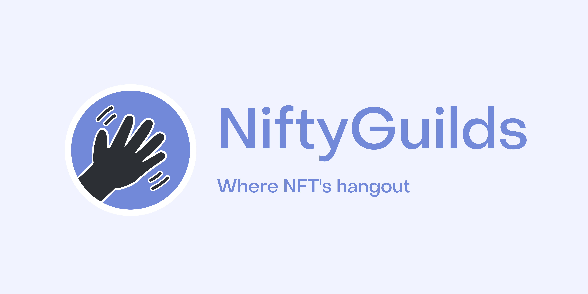

## NiftyGuilds

  

NiftyGuilds aims to be the Web3 Discord. NiftyGuilds is a permissionless NFT gated group chat DApp. User needs to simply connect their wallet and NiftyGuilds will automatically detect the NFTs in the wallet and enroll the user into respective servers to chat. Currently, anyone can create channels inside server however we plan to give roles and permissions to NFT collection owners to configure the server and the channel as well.

### How it's made

NiftyGuilds is built using NextJS. NiftyGuilds uses Covalent APIs to get the information regarding the NFTs in the connected wallet. NiftyGuilds uses Textile ThreadDB to store all the chats, server information and channel information. Servers are not created by the devs instead NiftyGuilds automatically detects if the user as an NFT whose server does not exists in the DApp then it simply creates it.
